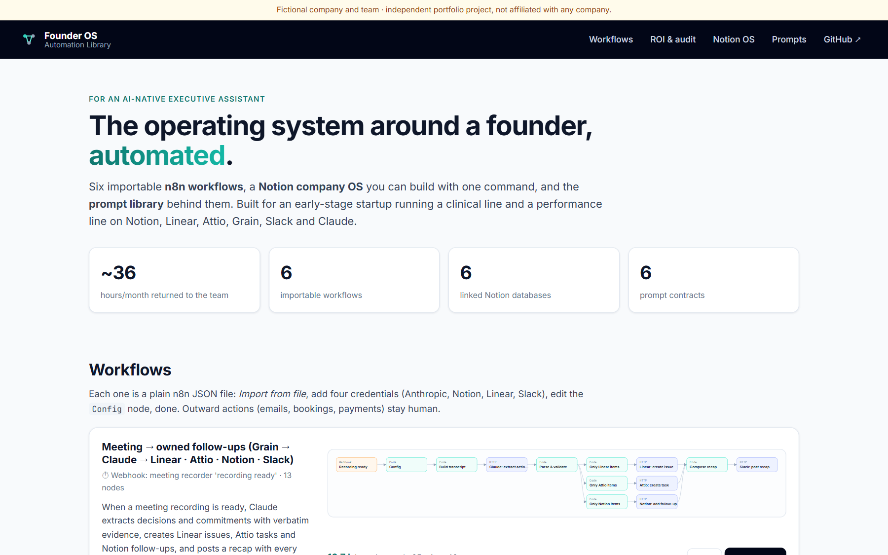

# Founder OS · Automation Library

**The no-code layer of an AI-native executive assistant:** six importable **n8n workflows**, a **Notion company OS** you can build with one command, and the **prompt library** behind them. Designed for an early-stage startup running a clinical line and a performance line on Notion, Linear, Attio, Grain, Slack and Claude.

[](https://founder-os-automations.vercel.app)
[](https://github.com/JavierMonestel/founder-os-automations/actions/workflows/ci.yml)




> **Browse it:** [founder-os-automations.vercel.app](https://founder-os-automations.vercel.app). It has every workflow with its diagram and a one-click JSON download, an ROI calculator and process audit you can edit, the Notion OS schema, and the prompt library.

---

## What's inside

| | | Saves |
|---|---|---|
| 🎙️ [`meeting-to-actions`](n8n/workflows/meeting-to-actions.json) | Grain "recording ready" → Claude extracts decisions and commitments **with verbatim evidence** → ungrounded items are dropped → Linear issues, Attio tasks and Notion follow-ups → recap to Slack | ~17 h/mo |
| ☀️ [`founder-daily-brief`](n8n/workflows/founder-daily-brief.json) | Weekdays 7:45 → company snapshot → Claude writes a 60-second brief → founder's Slack DM | ~7 h/mo |
| 🛎️ [`follow-up-radar`](n8n/workflows/follow-up-radar.json) | Weekdays 16:00 → overdue and due-tomorrow follow-ups from Notion → one friendly nudge per owner (deterministic, no model needed) | ~5 h/mo |
| 🎯 [`goals-to-linear`](n8n/workflows/goals-to-linear.json) | First Monday → active objectives from Notion → [OKR → Linear Planner](https://github.com/JavierMonestel/okr-to-linear) → capacity summary posted for approval | ~3 h/mo |
| 📈 [`investor-update-draft`](n8n/workflows/investor-update-draft.json) | Last weekday of the month → key results + work shipped in Linear → Claude drafts the update with sourced numbers and `[CHECK]` flags → Notion draft | ~2 h/mo |
| ✈️ [`travel-request`](n8n/workflows/travel-request.json) | Trip request → Claude prepares two itinerary options, calendar holds, conflicts and a checklist → Notion trip page. **Nothing is booked automatically.** | ~2 h/mo |
| 🗂️ [`notion_os/`](notion_os) | One command builds six linked databases: Objectives, Key Results (computed progress), Projects, Meetings, Decisions, Follow-ups (computed `Overdue`) | the single source of truth |
| ✍️ [`prompts/`](prompts) | Six prompt *contracts*: inputs, output format, what the model must never do, and the checks used to test it | |

The time estimates are conservative (minutes per run × runs per month) and are editable in the [ROI calculator](https://founder-os-automations.vercel.app/#audit).

## Design principles

- **Humans approve outward actions.** Workflows draft messages, plans and pages. Sending to externals, booking and paying stay human clicks.
- **Evidence or it didn't happen.** Meeting extraction requires a verbatim quote, and a Code node drops any item whose quote isn't in the transcript before anything is created.
- **Deterministic where possible.** The follow-up radar needs no model. Claude is used only where language understanding is the job.
- **No secrets in files.** Credentials are referenced by name (n8n *Header Auth* credentials). CI fails if anything that looks like a key is committed.
- **One source of truth.** Every workflow reads from and writes back to the Notion OS, Linear or Attio. Nothing lives only in Slack.

## Quality

The workflows are generated from Python definitions ([`n8n/workflows.py`](n8n/workflows.py)) so they stay consistent and testable:

| Check | How |
|---|---|
| **Imports into real n8n** | CI runs `n8n import:workflow` on every file (n8n 2.x) |
| **Parameters match n8n's node definitions** | node types and versions are verified against `n8n-nodes-base` (HTTP Request 4.2, Webhook 2, Schedule 1.2, Code 2, Respond 1.1) |
| **Code-node logic works** | `tests/code-nodes.test.mjs` runs the JavaScript inside each Code node with mocked `$input`, `$('Node')` and `$now`: grounding filter, refusal handling, per-owner grouping and sorting, last-business-day logic, Notion block splitting |
| **Structure is sound** | `n8n/validate.py`: one trigger, no orphan nodes, every `$('Node')` reference exists, no `}}` that would end an n8n expression early, empty credential ids, no secrets |
| **Generated files are current** | `python -m n8n.build --check` |
| **Notion OS is consistent** | relations target databases created earlier, formulas reference real properties, formulas are created before the rollups that read them (dry-run tests) |

```bash
pip install -r requirements-dev.txt && npm install
pytest -q                     # 24 Python tests
npm test                      # 10 Code-node tests
python -m n8n.build --check   # generated JSON is up to date
npm run validate:n8n          # import every workflow into n8n
```

## Use it

**n8n workflows**
1. In n8n: *Workflows → Import from file* → pick a JSON from [`n8n/workflows`](n8n/workflows).
2. Create the Header Auth credentials it asks for: `Anthropic API key (x-api-key)`, `Notion integration token (Authorization: Bearer)`, `Linear API key (Authorization)`, `Slack bot token (Authorization: Bearer)`.
3. Open the **Config** node and paste your Slack channel, Linear team and Notion data source IDs.

**Notion company OS**
```bash
export NOTION_API_KEY=ntn_...      # an internal integration with access to the parent page
python -m notion_os.bootstrap --parent <page-id> --dry-run       # review every request first
python -m notion_os.bootstrap --parent <page-id> --sample-data   # build it
```

## Repository layout

```
n8n/workflows.py      workflow definitions (Python) → n8n/workflows/*.json
n8n/lib.py            node helpers (HTTP, Code, Claude call, triggers) and layout
n8n/validate.py       static checks used by the build and CI
notion_os/schema.py   the six databases, relations, formulas, rollups
notion_os/bootstrap.py  builds it via the Notion API (with --dry-run)
prompts/              prompt contracts
site/                 static catalog: workflows, ROI & audit tool, Notion schema
tests/                pytest + node:test suites
```

---

**Built by [Javier Monestel](https://github.com/JavierMonestel)** as part of a portfolio on AI-native operations ([Command Center](https://github.com/JavierMonestel/founder-command-center) · [Meeting Action Router](https://github.com/JavierMonestel/meeting-action-router) · [OKR → Linear Planner](https://github.com/JavierMonestel/okr-to-linear)).
*Independent project. Not affiliated with, endorsed by, or built for any company. The company, team and data in the examples are fictional.*
